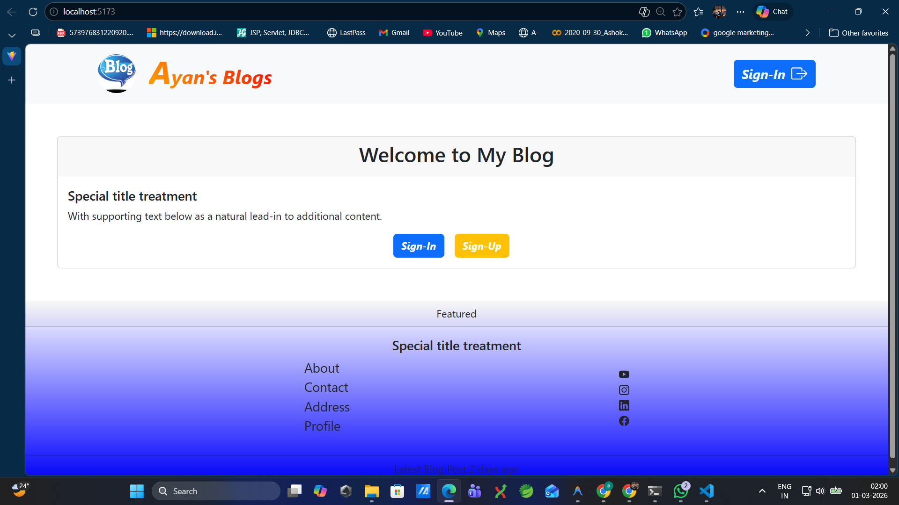
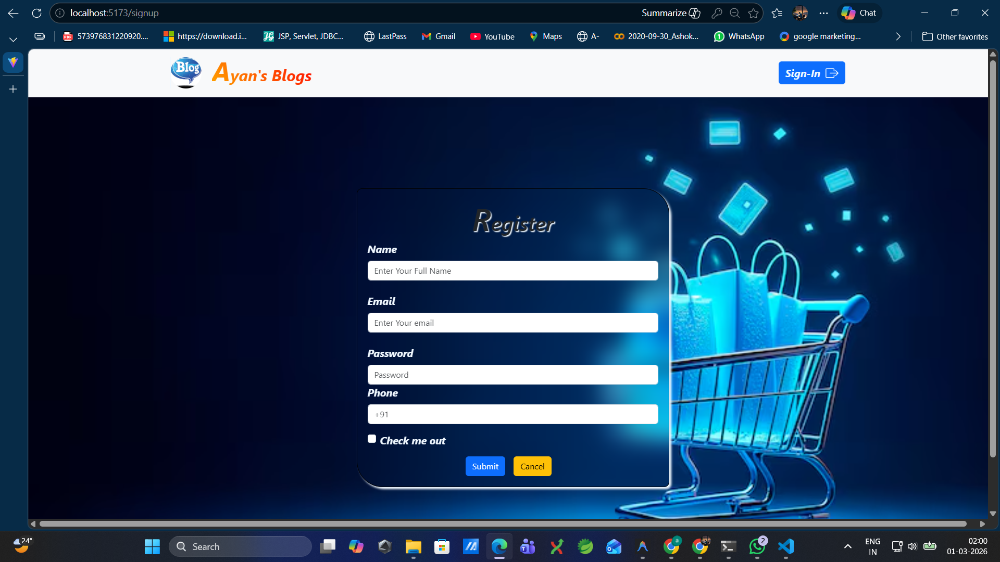
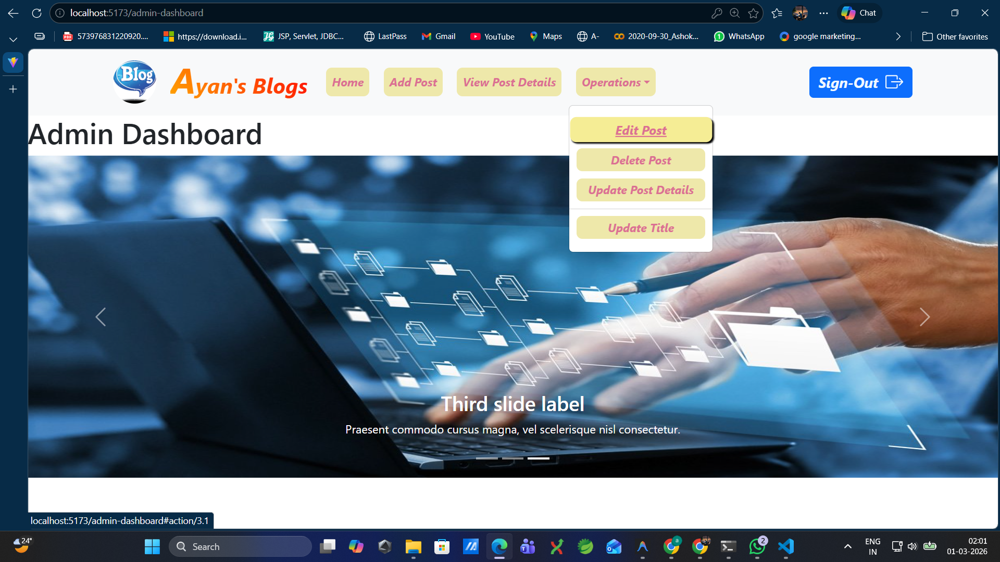

<h1 align="center">Date : 13-03-2026</h1>

# MERN PublishX – Smart Content Management System


A full-stack Content Management System (CMS) built utilizing the MERN stack (MongoDB, Express.js, React with Vite, and Node.js). This application enables users to easily add new content and view an aggregation of all published posts seamlessly through REST API integration. It's designed to be fast, responsive, and easy to maintain.

---

## 💻 Tech Stack

### Frontend ⚛️
* **React (Vite)**: Lightning-fast development environment and optimized builds.
* **State Management**: React Hooks (`useState`, `useEffect`).
* **API Client**: `Axios` (or `Fetch`) for asynchronous HTTP requests.
* **UI/UX**: Dynamic loading states and robust error handling logic.

### Backend ⚙️
* **Node.js**: Asynchronous, event-driven JavaScript runtime.
* **Express.js**: Minimalistic web framework for structured routing.
* **MongoDB**: NoSQL database for flexible data storage.
* **Mongoose**: Elegant MongoDB object modeling for Node.js.

---

## ✨ Features

* 🆕 **Create Posts**: Easily draft and publish content with title, author, and description.
* 📋 **View Posts**: Fetch and display all content smoothly in real-time.
* 🔄 **RESTful APIs**: Standardized backend endpoints for seamless frontend communication.
* 🚦 **UX Refinements**: Built-in loading states while fetching data and graceful error handling on failures.
* ⚡ **Optimized Performance**: Frontend scaffolding powered by Vite.

---

## 📂 Folder Structure

```text
MERN-PublishX/
├── backend/
│   ├── controllers/       # Logic for handling API requests
│   ├── models/            # Mongoose schemas (e.g., Post.js)
│   ├── routes/            # Express route endpoints
│   ├── config/            # DB connection setup
│   ├── .env               # Backend environment variables
│   ├── server.js          # Main entry point for backend
│   └── package.json       # Backend dependencies
│
└── frontend/
    ├── public/            # Static assets
    ├── src/
    │   ├── components/    # Reusable React components (e.g., PostList, AddPost)
    │   ├── services/      # API integration logic
    │   ├── App.jsx        # Main React component
    │   ├── main.jsx       # React DOM rendering
    │   └── index.css      # Global styles
    ├── .env               # Frontend environment variables
    ├── package.json       # Frontend dependencies
    └── vite.config.js     # Vite configuration
```

---

## 🔌 API Endpoints

### 1. Add a New Post
Creates a new post in the database.

* **URL**: `/api/addpost`
* **Method**: `POST`
* **Base URL**: `http://localhost:5000`
* **Request Body** (JSON):
```json
{
  "title": "string",
  "author": "string",
  "content": "string"
}
```
* **Success Response**: `201 Created`

### 2. Fetch All Posts
Retrieves a list of all published posts.

* **URL**: `/api/getallposts`
* **Method**: `GET`
* **Base URL**: `http://localhost:5000`
* **Success Response**: `200 OK` (Returns an array of JSON objects representing posts).

---

## 🚀 Installation & Setup Instructions

Follow these steps to set up the project locally on your machine.

### Prerequisites
* [Node.js](https://nodejs.org/) installed
* [MongoDB](https://www.mongodb.com/) installed locally or a MongoDB Atlas URI

### Step 1: Clone the Repository
```bash
git clone <your-repo-url>
cd MERN-PublishX
```

### Step 2: Backend Setup
```bash
# Navigate to the backend directory
cd backend

# Install dependencies
npm install

# Start the development server
npm run dev
```
*(The backend runs on `http://localhost:5000`)*

### Step 3: Frontend Setup
Open a new terminal window:
```bash
# Navigate to the frontend directory
cd frontend

# Install dependencies
npm install

# Start the Vite development server
npm run dev
```
*(The frontend runs on `http://localhost:5173`)*

---

## 🔐 Environment Variables

You need to add `.env` files in both the frontend and backend directories.

### Backend (`backend/.env`)
```env
PORT=5000
MONGO_URI=mongodb://localhost:27017/publishx
# Or use your MongoDB Atlas Connection String
```

### Frontend (`frontend/.env`)
```env
# Optional: depending on your API setup logic
VITE_API_BASE_URL=http://localhost:5000/api
```

---

## 🧩 How API Integration Works

1. **Frontend Initiation**: The React application uses the `useEffect` hook to trigger an asynchronous `GET` request (via `fetch` or `Axios`) when the app initially mounts to fetch the data.
2. **State Management**: Through the `useState` hook, the frontend app tracks data payloads, application `loading` states while the API resolves, and `error` states if the connection drops.
3. **Backend Processing**: The Express routes intercept the `/api/getallposts` or `/api/addpost` calls and pass them to controllers. The controllers interact directly with the MongoDB database using Mongoose models.
4. **Data Sync**: The Node server responds with a JSON payload, and the React frontend updates the UI dynamically without a page refresh.

---

## 📸 Screenshots

### Landing Page


### User Registration


### Admin Dashboard


---

## 📋 Assignment Instructions for Students

To contribute or submit your assignment for this project, please adhere to the following workflow:

1. 🍴 **Fork the Repository**: Click on the "Fork" button at the top-right of this GitHub page.
2. 👯 **Clone your Fork**: `git clone <your-forked-repo-url>`
3. 🌿 **Create a Branch**: Create a new branch heavily specific to your identity. 
   ```bash
   git checkout -b feature/roll-number-12345
   ```
4. 💻 **Make Changes**: Complete the assignment requirements locally.
5. 📤 **Push Changes**: Commit your changes and push them to your specific branch.
   ```bash
   git add .
   git commit -m "feat: completed api integration"
   git push origin feature/roll-number-12345
   ```
6. 🔄 **Create a Pull Request**: Go back to the original repository on GitHub and click "Compare & pull request".

---

## 🔮 Future Enhancements

* Add user authentication (Login/Register via JWT).
* Build Post edit (`PUT`) and delete (`DELETE`) functionality.
* Add pagination or infinite scroll for the post feed.
* Implement rich text editors using libraries like Quill or Draft.js.
* UI redesign leveraging Tailwind CSS or Material-UI.

---

## 👤 Author

**[Your Name / Your Organization Name]**  
*Full Stack Developer*  
* GitHub: [@Ashoka M](https://github.com/ashokm0603)
* LinkedIn: [Ashoka M](https://www.linkedin.com/in/ashoka-m-307984229/)

---
> ⭐ If you find this project helpful for learning the MERN Stack, please consider giving it a star on GitHub!
